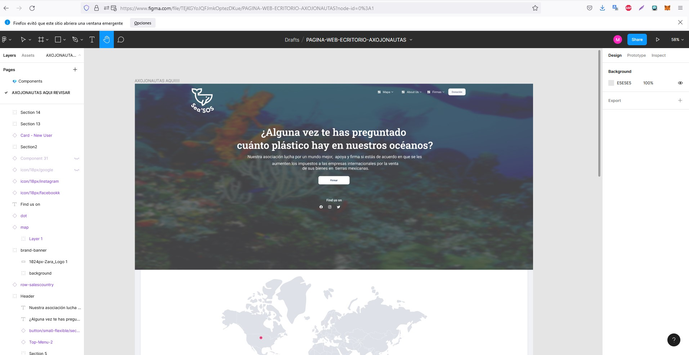
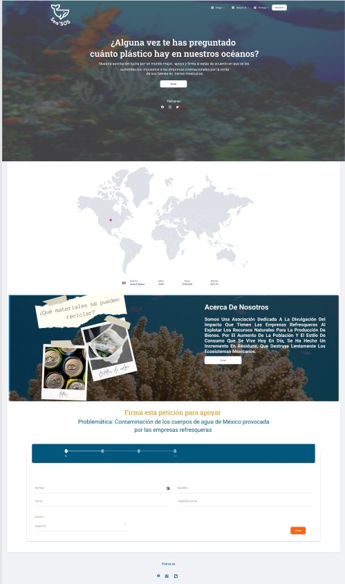
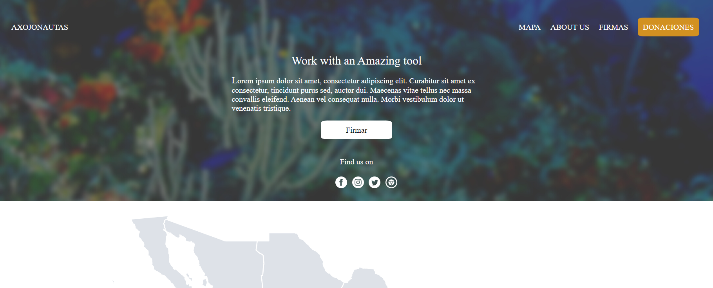
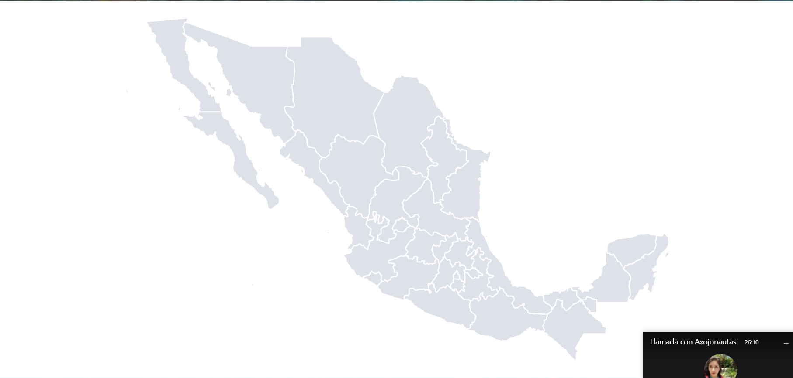
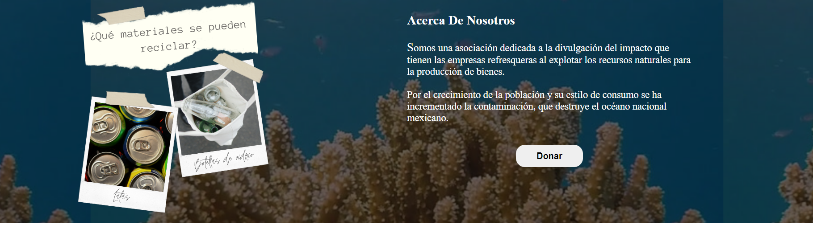
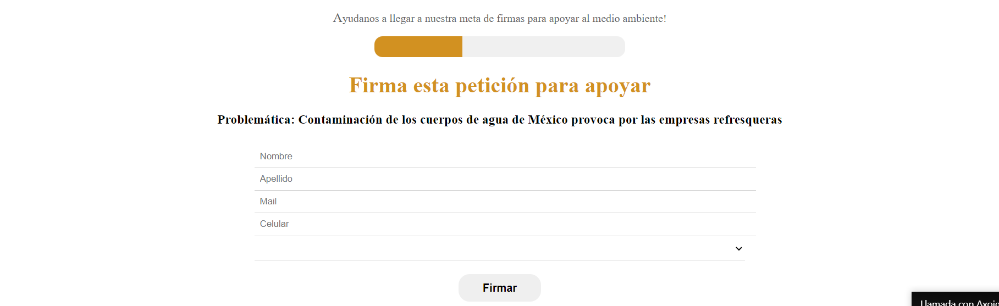
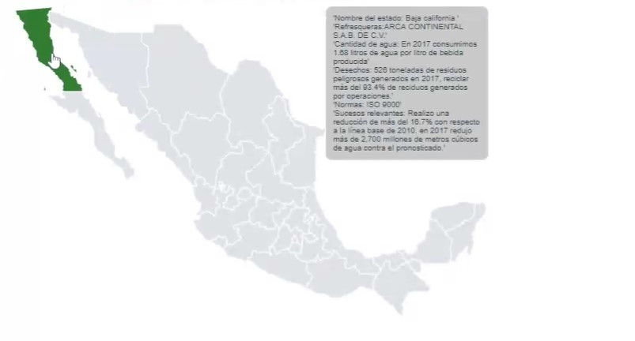
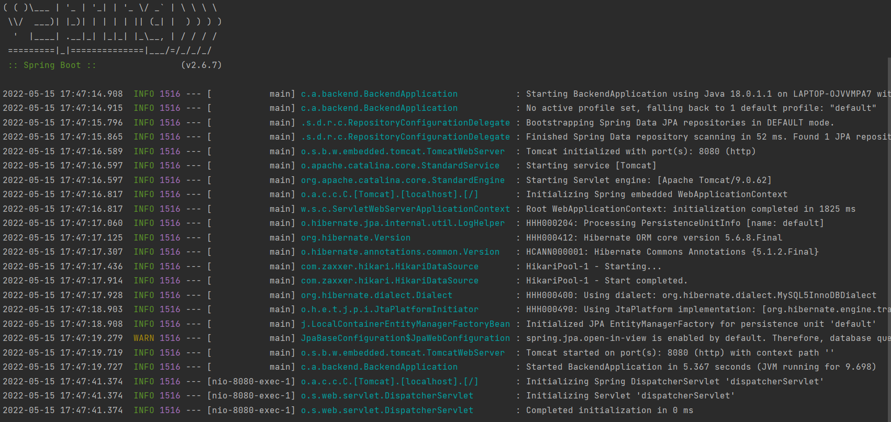
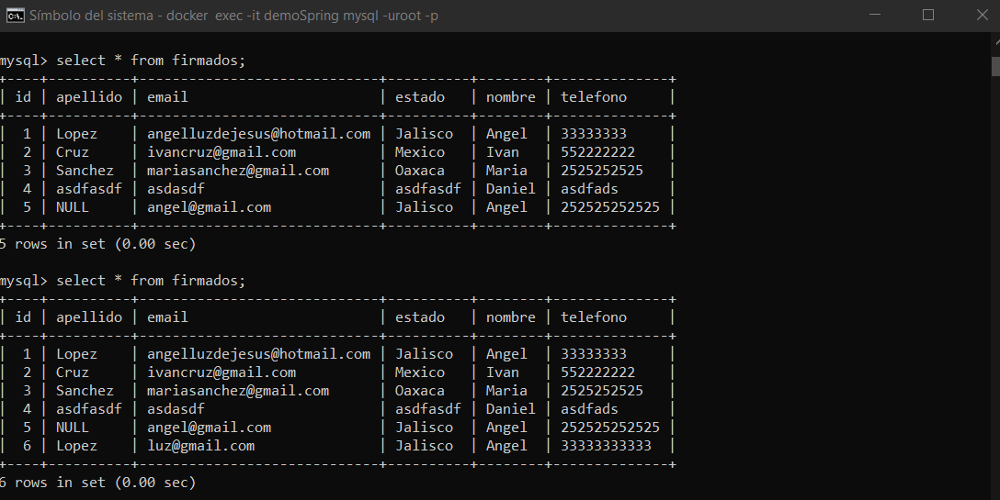
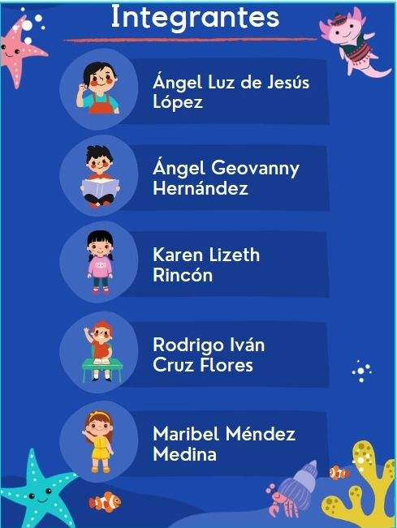

# HacktheOcean_Axojolonautas

## Link al repositorio de backend
   [Respositorio Backend](https://github.com/AngelLuzLU/BackEndHackTheOcean)
   
## Link al video de Tiktok
   [Video de tiktok](https://www.tiktok.com/@el_ivanovich.jpg/video/7098160554031729926?is_from_webapp=1&sender_device=pc&web_id=7098141360776316421)

# Introducción

Los refrescos forman parte esencial de la vida cotidiana de un mexicano, llegando al pensamiento que primero es  la adicción antes que la necesidad.

Nuestro país es uno de los principales consumidores de refresco, donde se calcula que una persona  consume 163 litros al año, además que es el mayor consumidor de botellas plásticas en el mundo, sin embargo las consecuencias que está dejando este problema ha llegado a provocar terribles daños a la fauna y flora marína, ya que  los procesos que se llevan a cabo para crear una botella plástica necesita él uso x número de agua para su proceso,  sin tomar en cuenta otros factores que también son explotados del medio ambiente

## ¿Cuál es el objetivo principal?

La divulgación del impacto que tienen las empresas refresqueras al explotar los recursos naturales para la producción de bienes. Por el aumento de la población y el estilo de consumo que se vive hoy en día, se ha hecho un incremento en residuos, que destruye lentamente el oceno.

## Solución planteada:

Aplicación web para divulgar información al respecto de la problemática y las posibles soluciones de la misma

## Tecnologías aplicadas

VEU, Java con spring, boot, jpa, html, css

# Modelado UX en Miro

Realizamos el Modelado UX con la Herramienta Miro

# Modelado UI en Figma

Realizamos el Modelado UI con la Herramienta Figma.

## Estructura de páginas webVista completa

   
   
## Página termianda

     
    
    
    
   
## Mapa de información
La principal característica del frontend de nuestra aplicación es un mapa para divulgar la información al respecto de la contaminación que ocasionan las operaciones de las refresqueras en los difenretes estados de la república, para esto se utilizó un mapa por estados de México y se añadieron funciones para que se muestre la información del Estado sobre el cual se coloque el cursor, de manera dinámica
    
   
## Funcionamiento Frontend - Backend
Mediante el uso de spring con JPA y hibernate se construyen un par de consultas para agregar a quienes firman la petición a una base de datos, así como para mostrar dentro de la página un progreso hacia un objetivo de firmas mediante una barra de progreso. En este caso se configuró la conexión considerando que la aplicación de vue corre en el puerto 3000 del localhost, spring en el 8080 y la base de datos de mySQL en el 3306

#### Corriendo en local
   Spring
   
   mySQL
   

   
## Integrantes del equipo

   
